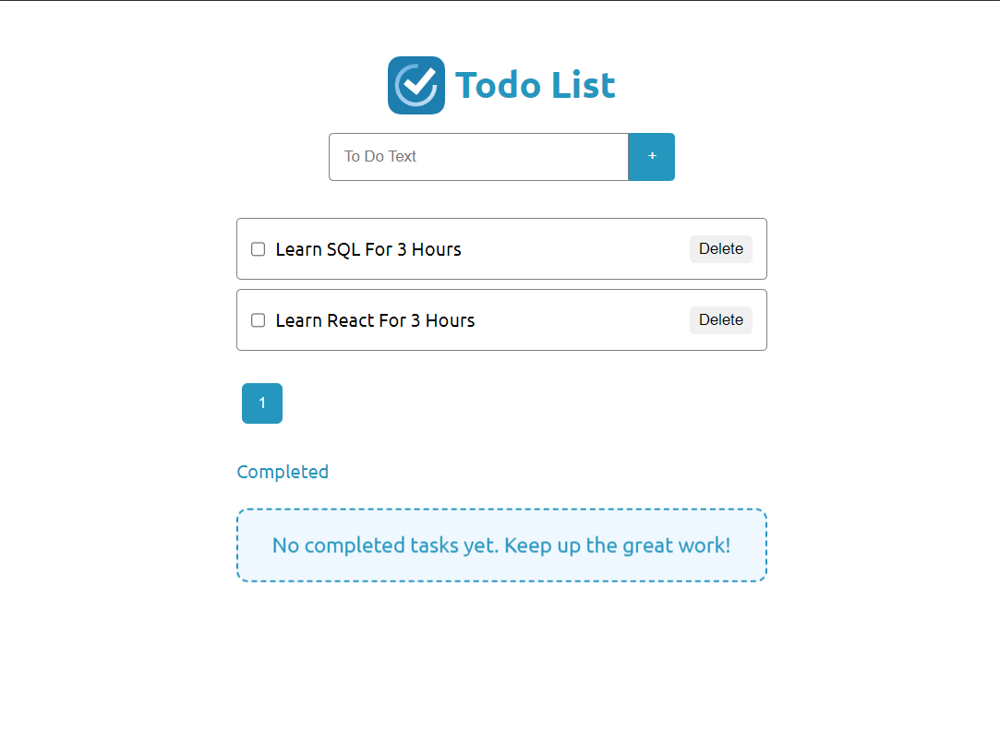
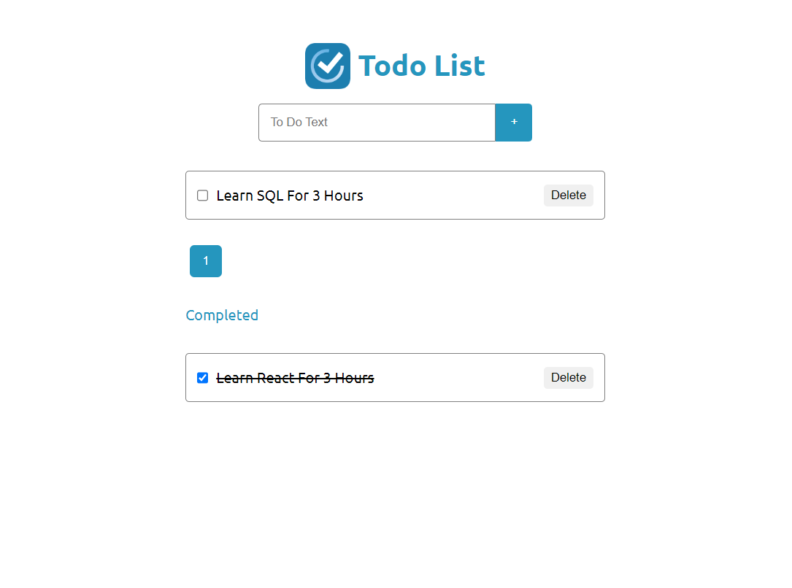

# Todo App

A simple and intuitive Todo App built using the MERN stack (MongoDB, Express.js, React.js, and Node.js). This application allows users to manage their tasks effectively by adding, updating, and deleting todos.
## Screenshots

### Homepage


### Add Task Page


## Features

- **Add Tasks**: Easily add new tasks with descriptions.
- **Update Tasks**: Edit tasks as needed.
- **Delete Tasks**: Remove completed or unwanted tasks.
- **Responsive Design**: Optimized for all devices.
- **Persistent Storage**: Tasks are stored in a MongoDB database.

## Technologies Used

- **Frontend**: React.js
- **State Management**: React Hooks/Context API/useReducer

## Prerequisites

Ensure you have the following installed:

- A package manager like `npm` or `yarn`

## Installation

1. Clone the repository:
   ```bash
   git clone https://github.com/Aliko2020/Todo-App.git
   cd todo-app
2. Install dependencies:
   npm install
3. npm run dev
